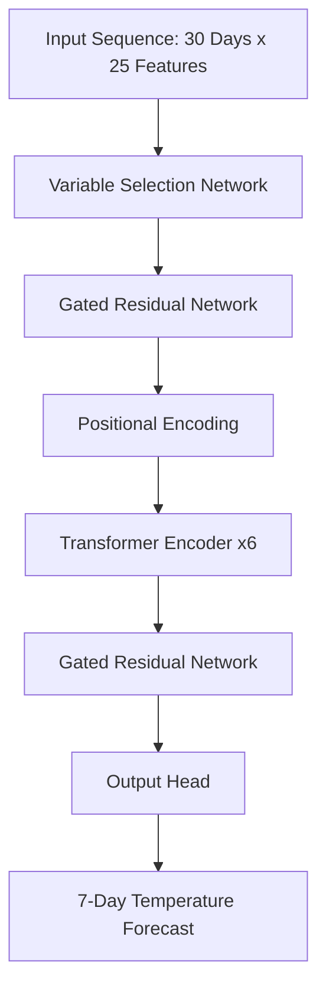

# 🌍 Weather Trend Forecasting System

> **PM Accelerator Mission**: "By making industry-leading tools and education available to individuals from all backgrounds, we level the playing field for future PM leaders. This is the PM Accelerator motto, as we grant aspiring and experienced PMs what they need most – Access. We introduce you to industry leaders, surround you with the right PM ecosystem, and discover the new world of AI product management skills."

> 📊 **[View Full Project Presentation →](presentation/)** | Comprehensive notebooks with EDA, Model Evolution, and Visualizations

[](https://www.python.org/downloads/)
[](https://pytorch.org/)
[](https://opensource.org/licenses/MIT)
[](https://github.com/psf/black)
[](https://www.docker.com/)

A production-grade machine learning system for precision global weather forecasting. Powered by an **Advanced Transformer with Gated Residual Networks (GRN)**, this system achieves a Mean Absolute Error (MAE) of **2.00°C** across 180+ countries.

It integrates **Open-Meteo real-time data** with a custom-trained neural network to provide accurate 7-day temperature trend predictions for any location on Earth.


---

## ✨ Key Features

- 🧠 **Advanced Transformer Model (V4)**
  - 1.3M parameters
  - **Gated Residual Networks (GRN)** for variable selection
  - **Multivariate Input**: Temperature, Humidity, Pressure, Wind, Cloud Cover, Precipitation
- 🌍 **Global Coverage**
  - Click-anywhere interactive map
  - Automatic climate zone detection
  - Works for any coordinate (Land or Ocean)
- 🔄 **Real-Time Data Integration**
  - Fetches live historical weather data from **Open-Meteo API**
  - Falls back to internal 15-year dataset if API is unavailable
- 🚀 **Production Ready**
  - **Dockerized** multi-stage build
  - **FastAPI** high-performance backend
  - **Plotly** interactive visualizations

---

## 🚀 Quick Start

### Option 1: Docker (Recommended)

Run the full production system locally:

```bash
docker compose up --build
```
Open **http://localhost:8001** to view the application.

### Option 2: Local Installation

**Prerequisites**: Python 3.11+

1. **Clone & Install**
   ```bash
   git clone https://github.com/moazmo/weather-trend-forecasting.git
   cd weather-trend-forecasting
   python -m venv .venv
   .venv\Scripts\activate  # Windows (or check platform specific command)
   pip install -r requirements.txt
   ```

2. **Run the Application**
   ```bash
   uvicorn v2.app.main:app --reload --port 8001
   ```
   Open **http://localhost:8001**

---

## 🧠 Model Architecture

The system uses a custom **Advanced Transformer** architecture designed for multivariate time-series forecasting.

### V4 Architecture Specs
*   **Input**: 30-day sequence of 25 features (Weather + Time + Geography)
*   **Variable Selection**: A **Variable Selection Network (VSN)** explicitly weights which features are important for the specific context.
*   **Attention Mechanism**: 4-Head Self-Attention layers to capture long-range temporal dependencies.
*   **Gating**: **Gated Residual Networks (GRN)** allow the model to skip layers or ignore noise, stabilizing training and improving convergence.
*   **Loss Function**: Huber Loss (robust to outliers).



### Performance Benchmarks

| Model Version | Architecture | MAE (Mean Absolute Error) | Status |
|---------------|--------------|---------------------------|--------|
| **V4.0 (Current)** | **Advanced Transformer + GRN** | **2.00°C** | 🟢 Production |
| V3.0 | Multivariate Transformer | 2.07°C | ⚪ Retired |
| V2.3 | Standard Transformer | 2.05°C | ⚪ Retired |
| V1.0 | MLP Baseline | ~4.50°C | ⚪ Legacy |

---

## 🌐 API Reference

The backend exposes a REST API for integration.

| Method | Endpoint | Description |
|--------|----------|-------------|
| `GET` | `/api/health` | System status, model version, and loaded capabilities |
| `GET` | `/api/nearest` | Find nearest country and climate zone for coordinates |
| `POST` | `/api/forecast` | Generate 7-day forecast. Payload: `{lat, lon, start_date}` |

**Example Request:**
```bash
curl -X POST "http://localhost:8001/api/forecast" \
     -H "Content-Type: application/json" \
     -d '{"lat": 30.04, "lon": 31.23, "start_date": "2024-06-15"}'
```

---

## 📁 Project Structure

```
WeatherTrendForecasting/
├── v2/                     # Core Source Code
│   ├── app/                # FastAPI Production Application
│   ├── models/             # Trained Model Artifacts (V4)
│   └── notebooks/          # Advanced R&D Notebooks
├── app/                    # Legacy V1 Application
├── data/                   # Processed Weather Datasets
├── docs/                   # Documentation & Assets
├── Dockerfile              # Production Docker Image
├── docker-compose.yml      # Local Development Config
└── requirements.txt        # Python Dependencies
```

---

## 📜 License

MIT License - see [LICENSE](LICENSE) for details.
