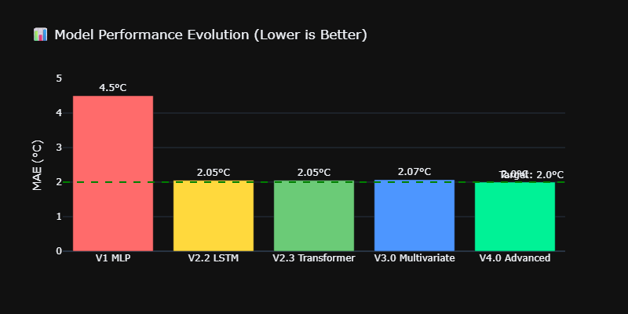
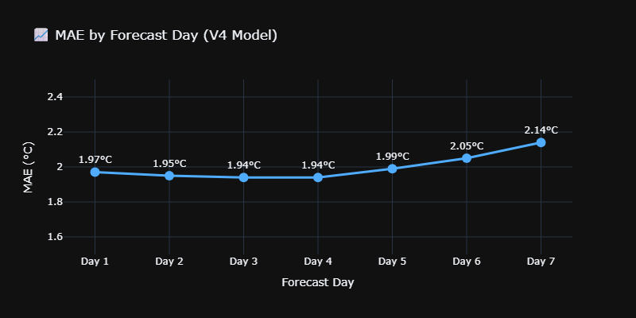

# 📊 Project Presentation

> **PM Accelerator Mission**: "By making industry-leading tools and education available to individuals from all backgrounds, we level the playing field for future PM leaders."

[](https://colab.research.google.com/github/moazmo/weather-trend-forecasting/blob/main/presentation/02_EDA_Analysis.ipynb)
[](https://nbviewer.org/github/moazmo/weather-trend-forecasting/tree/main/presentation/)

---

## 🎯 What You'll Learn

This presentation takes you through the complete journey of building a **production-grade AI Weather Forecasting System** — from raw data to a deployed web application achieving **2.00°C accuracy**.

---

## 📚 Notebooks

| # | Notebook | Description | View |
|---|----------|-------------|------|
| 1️⃣ | [**Project Overview**](01_Project_Overview.ipynb) | Mission, goals, dataset, and key results | [](https://nbviewer.org/github/moazmo/weather-trend-forecasting/blob/main/presentation/01_Project_Overview.ipynb) |
| 2️⃣ | [**EDA Analysis**](02_EDA_Analysis.ipynb) | Data cleaning, visualizations, anomaly detection | [](https://nbviewer.org/github/moazmo/weather-trend-forecasting/blob/main/presentation/02_EDA_Analysis.ipynb) |
| 3️⃣ | [**Model Evolution**](03_Model_Evolution.ipynb) | V1→V4 architecture journey, training, evaluation | [](https://nbviewer.org/github/moazmo/weather-trend-forecasting/blob/main/presentation/03_Model_Evolution.ipynb) |
| 4️⃣ | [**Climate & Spatial Analysis**](04_Climate_Spatial_Analysis.ipynb) | Long-term trends, geographic patterns, feature importance | [](https://nbviewer.org/github/moazmo/weather-trend-forecasting/blob/HEAD/presentation/04_Climate_Spatial_Analysis.ipynb) |
| 5️⃣ | [**Environmental Impact**](05_Environmental_Impact.ipynb) | Air quality analysis, pollution correlations | [](https://nbviewer.org/github/moazmo/weather-trend-forecasting/blob/HEAD/presentation/05_Environmental_Impact.ipynb) |

---

## 📈 Key Visualizations

### 🌡️ Global Temperature Distribution


### 🌍 Hemisphere Seasonality


### 📊 Model Performance Evolution


### 📈 Forecast Accuracy by Day


---

## 🏆 Final Results

| Metric | Value |
|--------|-------|
| **Model** | Advanced Transformer + GRN |
| **MAE** | 2.00°C ✅ |
| **Parameters** | 1.3 Million |
| **Coverage** | 186 Countries |
| **API** | FastAPI + Docker |

---

## 🚀 Try It Yourself

```bash
# Clone the repo
git clone https://github.com/moazmo/weather-trend-forecasting.git
cd weather-trend-forecasting

# Run with Docker
docker compose up --build

# Open http://localhost:8001
```

---

**Built with ❤️ by Moaz Muhammad**
